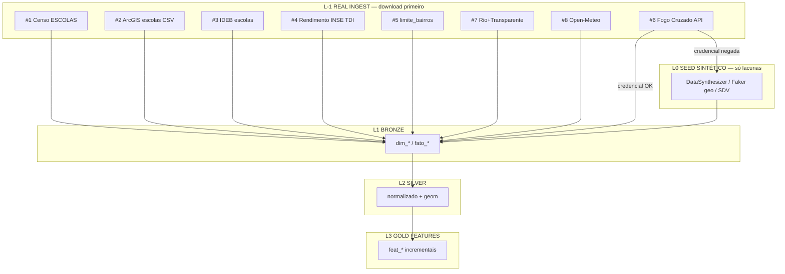

# Real vs. Sintético — Pipeline SME-Rio (Claude Impact Lab Rio #2)

**Data:** 2026-08-29  
**Complementa:** `Pipeline_Features_Sinteticas_Pulso_Rede.md` · `Modelo_Dados_Pulso_Rede_DuckDB.md` · `Geracao_Dados_Sinteticos_Pulso_Rede.md`

**Mudança de plano:** com as 8 URLs reais testadas, **não sintetize o que é wget**. SDV/Faker viram seguro (Plano C), não Plano A.

---

## 1. Camada nova: L-1 REAL INGEST (antes do seed sintético)



**Ordem obrigatória no domingo:** L-1 → (só se faltar) L0 → L1 → L2 → L3.

---

## 2. Diagnóstico: o que é real agora

| Tabela star schema | Fonte real | Status | Ação |
|--------------------|------------|--------|------|
| `dim_escola` | #1 Censo + #2 ArcGIS (1.590) | **Real** | join `designacao` zfill7 ↔ prefixo `NO_ENTIDADE` |
| `dim_territorio` | #5 limite_bairros (162) | **Real** | FeatureServer / GeoJSON |
| `fato_indicador_escola` | #3 IDEB + #4 rendimento/INSE/TDI | **Real** | substitui `frequencia` nominal (LGPD) |
| `fato_evento_geo` | #6 Fogo Cruzado API v2 | **Real com fricção** | cadastro + aprovação |
| `ponte_escola_evento` | cálculo buffer 300–500 m | **Derivada** | só depois de #2+#6 |
| `fato_orcamento` | #7 Rio+Transparente | **Real** | Orgao=1601; UO 16002–12 → CRE |
| clima / território | #8 Open-Meteo | **Real** | sem chave |
| `dim_tempo`, `dim_indicador` | catálogo fixo | Manual | 5 min |
| BigQuery `datario` | curinga | **Incerto** | tentar 1 query; se Denied → ignore |

**Conclusão:** 8/9 tabelas têm caminho real. Sintetizar Censo/IDEB/ArcGIS no dia é desperdício.

---

## 3. O que ainda falta de verdade (só isso merece sintético)

| Lacuna | Por que não tem aberto | Lib recomendada | Tipo de simulação |
|--------|------------------------|-----------------|-------------------|
| Fila de creche | só Power BI, sem export | **DataSynthesizer** (ε-DP) | sensível → privacidade formal |
| PDDE/PNAE por escola | sem endpoint | DataSynthesizer ou Copulas | se briefing pedir |
| `frequencia` nominal aluno | LGPD no BQ | **não use** — use abandono agregado INEP (#4) | — |
| ~30 escolas Censo sem geo ArcGIS | residual join | **Faker + Shapely** dentro do polígono do bairro | geo residual |
| Fogo Cruzado sem credencial | aprovação humana | Faker/numpy eventos **ou** sample público se existir | contingência narrativa |
| Dataset novo do briefing | desconhecido | SDV GaussianCopula / Synthcity | Plano C |

---

## 4. Bibliotecas — mapa completo (pesquisa 2025–2026)

| Lib | Instalar | Ponto forte | Quando usar **aqui** |
|-----|----------|-------------|----------------------|
| **wget / requests / pandas** | já tem | baixar real | **sempre primeiro** (#1–#5, #7, #8) |
| **crossfire[geodf]** | `pip install crossfire[geodf]` | GeoDataFrame Fogo Cruzado | #6 se credencial OK |
| **Faker (`pt_BR`)** | `pip install faker` | dummy cosmético | nomes/textos; **não** indicadores |
| **Shapely + GeoPandas** | `pip install shapely geopandas` | ponto **dentro** do polígono | geo residual Censo∖ArcGIS |
| **DataSynthesizer** | `pip install DataSynthesizer` | privacidade diferencial (ε) | fila creche / dado sensível |
| **copulas** | `pip install copulas` | Gaussian multivariate leve | 1 tabela numérica, sem GPU |
| **sdv** | `pip install sdv` | multi-table + GaussianCopula | Plano C / briefing novo |
| **ydata-synthetic** | `pip install ydata-synthetic` | TimeGAN séries | projetar IDEB além de 2025 (opcional) |
| **synthcity** | `pip install synthcity` | fairness + privacy metrics | pitch LGPD / violência×escola |
| **numpy + DuckDB** | base da pipeline features | features incrementais | L2→L3 sempre |

> Faker **sozinho** = dummy data, não synthetic data estatístico. Nunca use Faker para simular IDEB, abandono ou eventos geolocalizados “de verdade”.

---

## 5. URLs e comandos de download (L-1)

```bash
mkdir -p data/raw && cd data/raw

# #2 ArcGIS — já existe no projeto como escolas_municipais_sme_rio.csv
# opcional re-download:
curl -L -o escolas_arcgis.csv \
  "https://opendata.arcgis.com/api/v3/datasets/0a220ea7972449e39a28210dd317f636_1/downloads/data?format=csv"

# #1 Censo 2024 (grande)
curl -L -o microdados_censo_escolar_2024.zip \
  "https://download.inep.gov.br/dados_abertos/microdados_censo_escolar_2024.zip"

# #3 IDEB 2025 anos iniciais (exemplo — conferir nome exato no portal)
curl -L -o ideb_ai_escolas_2025.zip \
  "https://download.inep.gov.br/ideb/resultados/divulgacao_anos_iniciais_escolas_2025.zip"

# #7 Rio+Transparente
curl -L -o Open_Data_Desp_2025.csv \
  "https://riotransparente.rio.rj.gov.br/arquivos/Open_Data_Desp_2025.csv"

# #5 limite_bairros — export GeoJSON via FeatureServer query
# (ou use REST query outFields=* & f=geojson)

# #8 Open-Meteo — sob demanda por lat/lon (sem arquivo único)
```

**#6 Fogo Cruzado** — rodar cadastro **hoje**:

```bash
pip install "crossfire[geodf]"
# cadastrar em https://api.fogocruzado.org.br
# depois:
python -c "
from crossfire import occurrences
# id estado RJ — consultar docs
gdf = occurrences('<id_rj>', format='geodf')
gdf.to_file('data/raw/fogocruzado_rj.geojson')
"
```

---

## 6. Código só para as lacunas reais

### 6.1 Geo residual — ponto dentro do bairro (Shapely)

```python
# pip install faker shapely geopandas
from faker import Faker
from shapely.geometry import Point
import geopandas as gpd

fake = Faker("pt_BR")
bairros = gpd.read_file("data/raw/limite_bairros.geojson")  # #5

def ponto_dentro_do_bairro(cod_bairro: int) -> Point:
    poly = bairros.loc[bairros["CodBairro"] == cod_bairro, "geometry"].iloc[0]
    minx, miny, maxx, maxy = poly.bounds
    for _ in range(500):
        p = Point(
            fake.coordinate(center=(minx+maxx)/2, radius=abs(maxx-minx)/2),
            fake.coordinate(center=(miny+maxy)/2, radius=abs(maxy-miny)/2),
        )
        # fallback bounding-box sample:
        p = Point(
            fake.pyfloat(min_value=minx, max_value=maxx),
            fake.pyfloat(min_value=miny, max_value=maxy),
        )
        if poly.contains(p):
            return p
    return poly.centroid  # fallback seguro

# aplicar só em escolas do Censo sem match no ArcGIS
# escolas_sem_geo["geom"] = escolas_sem_geo["cod_bairro"].apply(ponto_dentro_do_bairro)
```

Melhor que lat/lon aleatório na cidade: a `ponte_escola_evento` continua coerente no bairro certo.

### 6.2 Fila de creche / dado sensível — DataSynthesizer (ε-DP)

```python
# pip install DataSynthesizer
from DataSynthesizer.DataDescriber import DataDescriber
from DataSynthesizer.DataGenerator import DataGenerator

# precisa de UMA amostra mínima real (planilha do dia ou LIMIT do BQ)
describer = DataDescriber(category_threshold=10)
describer.describe_dataset_in_correlated_attribute_mode(
    dataset_file="data/raw/amostra_fila_creche.csv",
    epsilon=1.0,   # cite no pitch: privacidade diferencial ε=1.0
    k=2,
)
describer.save_dataset_description_to_file("data/synthetic/descricao_fila.json")

generator = DataGenerator()
generator.generate_dataset_in_correlated_attribute_mode(
    n=5000,
    description_file="data/synthetic/descricao_fila.json",
)
generator.save_synthetic_data("data/synthetic/fila_creche_sintetica.csv")
```

**Pitch LGPD:** “sintético com garantia formal de privacidade diferencial (ε=1.0)”, não “dados fake”.

### 6.3 Contingência Fogo Cruzado — eventos plausíveis (numpy)

Só se a API não liberar a tempo. Use bbox + pesos do estudo Percursos (não Faker puro):

```python
import numpy as np, uuid, json
from datetime import datetime, timedelta

tipos = ["Operação policial", "Barricada", "Tiroteio", "Ação criminosa", "Disparo"]
p = [0.23, 0.32, 0.15, 0.10, 0.20]
# concentrar 40% perto de escolas CRE 1/4/5/8 (já no dim_escola)
# ... (mesmo padrão da Pipeline_Features_Sinteticas)
```

### 6.4 Plano C — SDV em 1 tabela do briefing

```python
# pip install sdv
from sdv.single_table import GaussianCopulaSynthesizer
from sdv.metadata import SingleTableMetadata
import pandas as pd

df = pd.read_csv("data/raw/briefing_novo.csv")
meta = SingleTableMetadata()
meta.detect_from_dataframe(df)
synth = GaussianCopulaSynthesizer(meta)
synth.fit(df)
synth.sample(5000).to_csv("data/synthetic/briefing_sintetico.csv", index=False)
```

---

## 7. Pipeline atualizada (5 camadas)

| Camada | Nome | Input | Output | Lib |
|--------|------|-------|--------|-----|
| **L-1** | Real ingest | 8 URLs | `data/raw/*` | curl, crossfire, open-meteo |
| **L0** | Seed sintético | só lacunas | `data/synthetic/*` | DataSynthesizer, Shapely, SDV |
| **L1** | Bronze | raw + synthetic | tabelas DuckDB | pandas, DuckDB |
| **L2** | Silver | bronze | `silver_escola`, geom | DuckDB spatial |
| **L3** | Gold features | silver | `feat_*`, `mart_*` | DuckDB SQL incremental |

Código L1–L3 continua em `Pipeline_Features_Sinteticas_Pulso_Rede.md` — **não muda** se as colunas bronze forem as mesmas.

---

## 8. Ordem de execução no dia

1. **Baixar** #1 #2 #3 #4 #5 #7 #8 (paralelo).  
2. **Cadastro Fogo Cruzado** (#6) — não deixar para domingo de manhã.  
3. Join #1×#2 → `dim_escola` real.  
4. IDEB + taxas → `fato_indicador_escola` real.  
5. Se #6 OK → buffer → `ponte_escola_evento`.  
6. **Só então** avaliar lacunas (creche / PDDE / briefing).  
7. Se precisar: DataSynthesizer ou SDV **numa** tabela.  
8. `build_features()` incremental → FastAPI.

---

## 9. Checklist rápido

- [ ] #2 CSV local OK (`escolas_municipais_sme_rio.csv`)  
- [ ] wget #1 #3 #4 #7  
- [ ] #5 polígonos  
- [ ] #6 credencial solicitada  
- [ ] #8 script lat/lon  
- [ ] BQ `datario` testado 1× (se Denied, seguir)  
- [ ] Lacunas sensíveis → DataSynthesizer com ε no pitch  
- [ ] Features L3 sem reprocessar bronze  

---

## 10. Relação com os outros MDs

| Arquivo | Papel agora |
|---------|-------------|
| **Este** | Real-first + libs por lacuna + L-1 |
| `Pipeline_Features_Sinteticas_Pulso_Rede.md` | L0–L3 features incrementais (Faker/numpy/DuckDB) |
| `Modelo_Dados_Pulso_Rede_DuckDB.md` | DDL / grãos |
| `Geracao_Dados_Sinteticos_Pulso_Rede.md` | regras de domínio se L0 for necessário |
| `escolas_municipais_sme_rio.csv` | seed real #2 já no projeto |

**Regra de ouro:** número na tela = SQL sobre dado real sempre que existir URL; sintético só com lib certa e justificativa (ε, residual geo, ou briefing).
